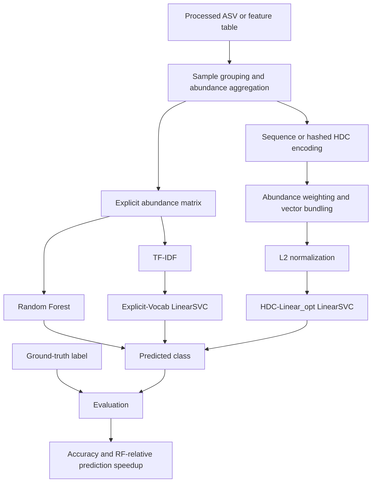

# Multi-Variant Classification: Final Three-Method Summary

This directory consolidates the final results for three classifier families:

1. **Random Forest (RF)**
2. **Explicit-Vocab (SVM)**
3. **HDC-Linear_opt**

The evaluated tasks are Marine eDNA location prediction, EMP 16S EMPO1-3
classification, HMTOL Country prediction before QC, and HMTOL Continent/Region
prediction after study-level QC.

## Classification pipeline



This is the correct high-level pipeline, with two important qualifications:

- Random Forest does not use the sequence/HDC encoding. It receives the
  explicit sample-by-feature abundance matrix.
- The final HDC encoder is not identical for every dataset. Marine eDNA uses
  non-negative feature hashing over taxonomy and sequence tokens. EMP and
  HMTOL use sequence-derived sparse bipolar random indexing.

## Method definitions

| Method | Model input and classifier |
|---|---|
| Random Forest | Explicit ASV/feature abundance matrix; 300-tree RandomForestClassifier. |
| Explicit-Vocab (SVM) | Explicit feature vocabulary, TF-IDF, and LinearSVC. |
| HDC-Linear_opt | Tuned fixed-dimensional HDC representation, normalization, and a linear SVM readout. |

For Marine eDNA, the input tokens include `domain`, `phylum`, `class`,
`order`, `family`, `genus`, `species`, and ASV sequence k-mers. EMP and HMTOL
start from 16S ASV abundance tables and use ASV sequences to construct the HDC
projection. Taxonomy plus sequence HDC was tested separately for HMTOL but is
not the final HDC model reported here.

## Verified accuracy

| Dataset/task | Target | RF | Explicit-Vocab | HDC-Linear_opt | HDC dimension |
|---|---|---:|---:|---:|---:|
| Marine eDNA | `geo_loc_name` | 0.8869 | 0.9550 | **0.9640** | 32,768 |
| EMP 16S EMPO1 | `empo_1` | 0.9411 | **0.9654** | 0.9630 | 32,768 |
| EMP 16S EMPO2 | `empo_2` | 0.9350 | **0.9612** | 0.9596 | 16,384 |
| EMP 16S EMPO3 | `empo_3` | 0.9157 | **0.9523** | 0.9467 | 32,768 |
| HMTOL before QC | Country | 0.8559 | 0.9787 | **0.9790** | 32,768 |
| HMTOL QC | Continent | 0.3783 | 0.4279 | **0.4318** | 32,768 |
| HMTOL QC | Region | 0.3160 | **0.4373** | 0.4295 | 32,768 |

The HMTOL before-QC Country result uses a sample-level random split and Country
is confounded with Study ID. The QC results use three-fold study-held-out
evaluation, so their lower accuracy is a more realistic measure of
cross-study generalization.

## EMP HDC dimension sweep

The reproducible accuracy sweep is implemented in
`sweep_emp_hdc_dimensions.py`. It evaluates dimensions from 1,024 through
32,768 using the same stratified 80/20 split, whole-sequence projection, and
training-subset TF-IDF. The selected `active_dims` and `LinearSVC C` are held
fixed for each EMPO level so that this experiment isolates hypervector
dimension:

| HDC dimension | EMPO1 | EMPO2 | EMPO3 |
|---:|---:|---:|---:|
| 1,024 | 0.9340 | 0.9415 | 0.9038 |
| 2,048 | 0.9449 | 0.9481 | 0.9215 |
| 4,096 | 0.9489 | 0.9529 | 0.9390 |
| 8,192 | 0.9582 | 0.9576 | 0.9461 |
| 16,384 | 0.9618 | 0.9596 | 0.9467 |
| 32,768 | **0.9630** | **0.9596** | **0.9487** |

The new sweep suggests that 32,768 dimensions may improve EMPO3 accuracy by
about 0.2 percentage points over 16,384. The canonical speedup table below
retains the previously measured timing values; changing the dimension requires
a separate GPU speedup rerun before those timing values are updated.

Run the sweep with:

```bash
python3 sweep_emp_hdc_dimensions.py \
  --biom /path/to/emp_deblur_90bp.release1.biom \
  --metadata /path/to/emp_qiime_mapping_release1.tsv \
  --outdir emp_16s_dimension_sweep
```

The generated files are `emp_16s_dimension_sweep/dimension_accuracy.csv` and
`emp_16s_dimension_sweep/emp_16s_dimension_accuracy.svg`.

## Prediction speedup

The canonical speedup values below are RF-relative prediction-pipeline results.
Training is excluded. Each speedup is meaningful within its own task, but the
absolute values must not be compared across datasets because input caches and
execution backends differ.

| Dataset/task | RF | Explicit-Vocab | HDC-Linear_opt | HDC execution |
|---|---:|---:|---:|---|
| Marine eDNA | 1.00x | 0.88x | 9.88x | GPU cached-input pipeline |
| EMP 16S EMPO1 | 1.00x | 1.26x | 19.76x | GPU cached-input pipeline |
| EMP 16S EMPO2 | 1.00x | 1.25x | 19.93x | GPU cached-input pipeline |
| EMP 16S EMPO3 | 1.00x | 1.23x | 35.97x | GPU cached-input pipeline |
| HMTOL before QC | 1.00x | 5.33x | 15.96x | GPU cached-input pipeline |
| HMTOL QC Continent | 1.00x | 4.04x | 7.45x | GPU optimized precache pipeline |
| HMTOL QC Region | 1.00x | 4.08x | 7.78x | GPU optimized precache pipeline |

The Marine HDC timing includes sparse cache opening, host-to-device transfer,
GPU sparse linear readout, and the prediction copy back to the host. The EMP
and HMTOL HDC timings include their respective cache opening, host-to-device
transfer, HDC accumulation, normalization, and linear readout. The RF and HDC
caches are not stored in identical formats, so these values are
deployment-oriented rather than raw-BIOM end-to-end comparisons.

## Corrections to the draft table

- The Marine eDNA row had copied HMTOL values. Its verified accuracies are
  `0.8869`, `0.9550`, and `0.9640` for RF, Explicit-Vocab, and HDC,
  respectively.
- EMP EMPO3 Explicit-Vocab accuracy is `0.9523`, not `0.9350`.
- The EMP `16.7x-17.5x` values came from an asymmetric benchmark: HDC loaded a
  memory-mapped CSR cache while the RF baseline included previously measured
  raw BIOM parsing. They are retained in `legacy_speedup_audit.csv` but are not
  used in the canonical table.
- The Marine GPU cached-input rerun preserves HDC accuracy (`0.9640`) and
  measures `9.88x` speedup versus the RF prediction baseline. The older `0.98x`
  value was from the CPU hashed pipeline and is no longer the canonical Marine
  HDC execution result.

## Files

- `final_results.csv`: canonical long-form accuracy and speedup table.
- `final_results_wide.csv`: compact table for slides or spreadsheets.
- `sweep_emp_hdc_dimensions.py`: reproducible EMP HDC dimension/accuracy sweep.
- `emp_16s_dimension_sweep/`: sweep CSV, settings, and accuracy plots.
- `legacy_speedup_audit.csv`: disposition of the speedups in the draft table.
- `source_manifest.csv`: source artifact for every result family.
- `validate_final_results.py`: checks method coverage, ranges, dimensions, and
  RF reference values.
- `scripts/`: four clean dataset entrypoints containing only Random Forest,
  Explicit-Vocab (SVM), and HDC-Linear_opt, plus one shared utility module.
  See `scripts/README.md` for commands.

Run the validation with:

```bash
python3 validate_final_results.py
```

## Interpretation

HDC improves accuracy most clearly on Marine eDNA and HMTOL Country under a
random split. On EMP, Explicit-Vocab is slightly more accurate than tuned
linear HDC at all three EMPO levels. Under HMTOL study-held-out QC, HDC and
Explicit-Vocab are close, indicating that cross-study domain shift, rather
than classifier capacity alone, is the main limitation.
